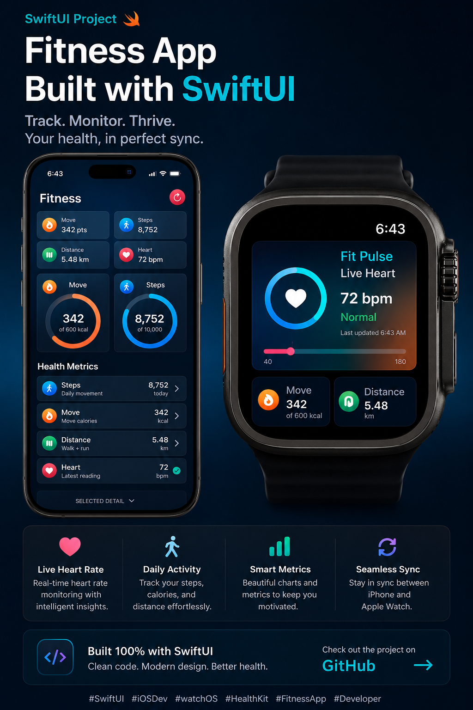

# FitnessApp
# 🏃‍♂️ Fit Pulse - Fitness Tracker App

A modern **iOS & Apple Watch Fitness Tracking Application** built with **SwiftUI**, **HealthKit**, and **WatchConnectivity**.

Fit Pulse helps users monitor daily health activities with real-time synchronization between iPhone and Apple Watch. The app provides a clean, responsive, and beautiful SwiftUI interface for tracking fitness goals.

---

## 📱 App Preview

### iPhone + Apple Watch



---

# ✨ Features

## 📱 iPhone Application

✔ Modern SwiftUI Dashboard  
✔ Daily Activity Summary  
✔ Real-time Health Metrics  
✔ Interactive Fitness Cards  
✔ Progress Ring UI  
✔ Health Data Visualization  

Track:

- 👣 Steps Count
- 🔥 Active Calories
- 📍 Walking + Running Distance
- ❤️ Heart Rate

---

## ⌚ Apple Watch Application

Apple Watch companion app provides live fitness monitoring directly from your wrist.

Features:

- ❤️ Live Heart Rate Tracking
- 🔥 Move Calories
- 📍 Distance Monitoring
- 👣 Activity Updates
- 📡 Sync Data with iPhone
- ⚡ Lightweight watchOS UI

---

# ❤️ HealthKit Integration

The application integrates Apple HealthKit framework to securely access and process user health information.

HealthKit Data Types:

```swift
HKQuantityTypeIdentifier.stepCount

HKQuantityTypeIdentifier.heartRate

HKQuantityTypeIdentifier.activeEnergyBurned

HKQuantityTypeIdentifier.distanceWalkingRunning
```

The app supports:

✔ Health Authorization  
✔ Reading Health Data  
✔ Real-time Updates  
✔ Background Health Monitoring  

---

# 🔄 iPhone & Apple Watch Communication

Implemented using:

```swift
WatchConnectivity Framework
```

Communication Flow:

```text
Apple Watch
      |
      |
WatchConnectivity
      |
      |
iPhone App
```

Used for:

- Sending live heart rate updates
- Sharing activity data
- Keeping devices synchronized

---

# 🏗 Architecture

The project follows a clean **MVVM Architecture**.

```text
FitnessApp
│
├── Models
│
├── Views
│   ├── Dashboard
│   ├── Activity Cards
│   └── Components
│
├── ViewModels
│
├── Managers
│   ├── HealthKitManager
│   └── ConnectivityManager
│
└── Watch App
    |
    ├── Watch Views
    ├── Health Service
    └── Watch Connectivity
```

---

# 🛠 Technology Stack

| Technology | Usage |
|-|-|
| Swift | Programming Language |
| SwiftUI | UI Development |
| HealthKit | Health Data |
| WatchConnectivity | iPhone Watch Sync |
| Combine | Data Binding |
| watchOS | Apple Watch App |
| MVVM | Architecture |

---

# ⚙️ Requirements

- Xcode 16+
- Swift 6+
- iOS 18+
- watchOS 11+
- Apple Developer Account
- Physical Apple Watch (recommended)

---

# 🚀 Installation

Clone repository:

```bash
git clone https://github.com/username/FitnessApp.git
```

Open project:

```bash
cd FitnessApp

open FitnessApp.xcodeproj
```

Enable capabilities:

```
Signing & Capabilities
        +
        |
        ├── HealthKit
        ├── Background Modes
        └── Watch Connectivity
```

Run:

- Select iPhone Target
- Select Apple Watch Target
- Build & Run

---

# 🔐 Privacy Permission

Add HealthKit usage descriptions:

```xml
<key>NSHealthShareUsageDescription</key>
<string>
Allow access to display your fitness activity.
</string>


<key>NSHealthUpdateUsageDescription</key>
<string>
Allow updating your health information.
</string>
```

---

# 📌 Upcoming Features

- 📊 Weekly Health Reports
- 🏃 Workout Sessions
- 🎯 Fitness Goals
- 📈 Advanced Charts
- 🔔 Activity Notifications
- ☁️ iCloud Sync
- 🤖 AI Health Insights

---

# 📚 Learning Purpose

This project demonstrates:

- Building production-level SwiftUI apps
- Working with Apple HealthKit
- Creating watchOS applications
- Real-time device communication
- Managing health permissions
- MVVM project structure

---

# 👨‍💻 Developed Using

❤️ SwiftUI  
⌚ watchOS  
🍎 Apple Ecosystem  

---

If you like this project, don't forget to ⭐ the repository!

#SwiftUI #HealthKit #watchOS #iOSDevelopment
